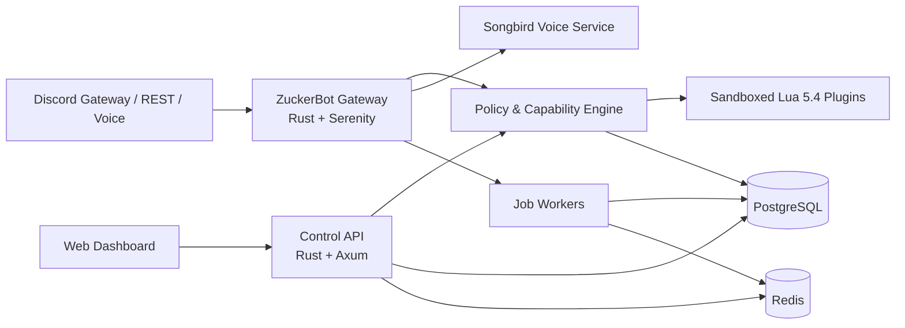

# ZuckerBot

**ZuckerBot** to otwarta, modułowa platforma automatyzacji Discorda: szybki i bezpieczny rdzeń w **Rust**, rozszerzenia serwerowe w **Lua 5.4**, muzyka przez warstwę głosową Songbird oraz centralny panel WWW.

Projekt docelowo łączy funkcje moderacji, bezpieczeństwa, muzyki, ticketów, ról, poziomów, ekonomii, powiadomień, wydarzeń, analityki i własnych automatyzacji. Nie jest projektowany jako jeden wielki plik z setkami komend. Każdy obszar jest oddzielnym modułem z własnymi uprawnieniami, konfiguracją, migracjami i testami.

> **Stan:** działający fundament platformy. Repozytorium nie jest jeszcze kompletnym zamiennikiem MEE6. Aktualnie zawiera klienta Discord, rejestr komend z Lua, ograniczony sandbox Lua, pierwsze komendy, warstwę głosową, API panelu, interfejs startowy, schemat PostgreSQL, Redis/Docker i CI.

## Co już działa

- klient Discord oparty na Serenity z automatycznym shardingiem;
- synchronizacja komend aplikacji globalnie albo natychmiastowo na serwerze deweloperskim;
- wykrywanie modułów `plugins/*/main.lua`;
- komendy `/ping`, `/about` i `/meme` napisane w Lua;
- walidacja nazw, opisów i odpowiedzi zgodnie z limitami Discorda;
- limit pamięci i instrukcji Lua oraz brak dostępu skryptów do systemu plików, procesów i sieci;
- Songbird zarejestrowany jako fundament muzyki i kanałów głosowych;
- API `/health` i `/api/v1/meta` oraz responsywny panel startowy;
- początkowy model danych PostgreSQL dla serwerów, modułów, skryptów, moderacji, zadań i audytu;
- środowisko Docker Compose z PostgreSQL i Redis;
- testy jednostkowe sandboxa, kontraktów i konfiguracji.

Pełny zakres produktu znajduje się w [macierzy funkcji](docs/FEATURE_MATRIX.md), a kolejność wdrażania w [roadmapie](docs/ROADMAP.md).

## Architektura



Najważniejsza granica bezpieczeństwa: Lua opisuje logikę, ale operacje uprzywilejowane wykonuje Rust po sprawdzeniu możliwości modułu, uprawnień użytkownika i konfiguracji serwera. Token bota nigdy nie trafia do Lua ani do przeglądarki.

## Uruchomienie lokalne

Wymagania: Rust 1.88, CMake, `pkg-config`, biblioteka Opus oraz opcjonalnie FFmpeg dla przyszłych źródeł audio.

```bash
git clone https://github.com/z-u-c-k-e-r/rust-discord-bot.git
cd rust-discord-bot
cp .env.example .env
```

Uzupełnij `DISCORD_TOKEN` i najlepiej `DISCORD_DEVELOPMENT_GUILD_ID`. Następnie:

```bash
cargo run -p zuckerbot-bot
```

Panel i API uruchamiają się osobno:

```bash
cargo run -p zuckerbot-api
```

Panel będzie dostępny pod `http://localhost:8080`. PostgreSQL i Redis można uruchomić bez aplikacji:

```bash
docker compose up -d postgres redis
```

Cały stos:

```bash
docker compose up --build
```

## Dodawanie komendy w Lua

```lua
return {
  metadata = {
    name = "hello",
    version = "0.1.0",
    description = "Example plugin"
  },
  commands = {
    {
      name = "hello",
      description = "Wita użytkownika.",
      dm_permission = true,
      handler = function(ctx)
        return {
          content = "Cześć, " .. ctx.user_name .. "!",
          ephemeral = false
        }
      end
    }
  }
}
```

Zapisz plik jako `plugins/hello/main.lua` i uruchom bota ponownie. Aktualny kontrakt oraz planowane API zdarzeń, storage, harmonogramów i dozwolonych żądań HTTP opisuje [Lua SDK](docs/LUA_SDK.md).

## Bezpieczeństwo i zasady platformy

ZuckerBot nie będzie obsługiwał self-botów, kradzieży tokenów, obchodzenia rate limitów, raidów, masowego spamu ani pozyskiwania muzyki z naruszeniem praw dostawców. Funkcje administracyjne będą wymagały jawnych uprawnień, audytu, limitów oraz możliwości cofnięcia operacji. Szczegóły: [SECURITY.md](docs/SECURITY.md).

## Dokumentacja

- [Architektura](docs/ARCHITECTURE.md)
- [Pełna macierz funkcji](docs/FEATURE_MATRIX.md)
- [Lua SDK](docs/LUA_SDK.md)
- [Roadmapa](docs/ROADMAP.md)
- [Model bezpieczeństwa](docs/SECURITY.md)
- [Środowisko deweloperskie](docs/DEVELOPMENT.md)
- [Aktualny stan](STATUS.md)
- [Dziennik pracy](WORKLOG.md)

## Licencja

MIT. Zewnętrzne integracje i źródła treści zachowują własne warunki korzystania.
